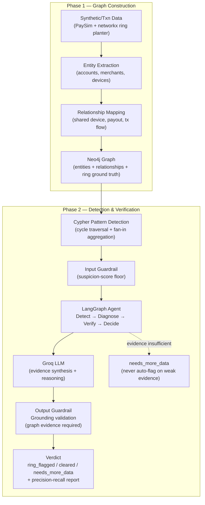

# Architecture

Two phases: graph construction, then detection & verification.

## Phase 1 — Graph Construction

| Step | File | What it does |
|---|---|---|
| Load | `src/data/load_paysim.py` | Reads `archive/paysim.csv`, validates schema, tightens dtypes, derives `orig_kind`/`dest_kind` (customer vs. merchant) from PaySim's `C`/`M` naming convention. |
| Plant | `src/data/plant_rings.py` | Builds a directed transaction graph from the loaded rows, then plants synthetic `shared_device`, `shared_payout`, and `circular_flow` rings (each at "obvious" and "subtle" difficulty) plus `legit_cluster` hard negatives, stratified train/test per ring type. This is the ground truth `eval/metrics.py` scores against. |
| Push | `src/data/build_graph.py` | UNWIND-batched writes into Neo4j: `(:Account {account_id, kind, device_id?})` nodes, `(:Account)-[:TRANSACTED_WITH {amount, step, type}]->(:Account)` for every transaction (real + planted), `(:Account)-[:SHARES_PAYOUT]->(:Account)` derived from each shared_payout ring's actual planted legs. Every planted node/relationship carries `ring_id`, `ring_type`, `difficulty`, `split` — ground truth is queryable in Neo4j directly, not only in Python. |

**Sampling matters here in a way that isn't obvious**: load with `--sample-frac`,
not `--nrows`. PaySim's rows are ordered by `step`; `--nrows N` takes the
first N rows, which only spans a handful of the dataset's 743 steps. That
collapses every transaction into a tiny time window — real and planted
activity alike — which silently breaks any time-window-based detection
signal in Phase 2. `--sample-frac` samples across the full timeline instead.

## Phase 2 — Detection & Verification

### Why Cypher pattern detection, not GDS

Generic community-detection algorithms (Louvain, WCC, and friends) are built
for a specific job: discovering *unknown* cluster structure in a large,
messy graph where you don't know what shape you're looking for. That's not
this problem. The three ring types here — closed transaction cycles,
shared-device clusters, payout fan-in — are targets we designed ourselves,
so their exact graph shape is known in advance. When the shape is known, a
hand-written Cypher pattern query that checks for that specific shape is
more precise, more interpretable, and easier to justify per match than a
black-box community-detection score would be. `src/detection/detection.py`
implements each ring type as a targeted, explainable check instead of a
generic clustering pass:

- **shared_device** → group accounts by the `device_id` node property.
- **shared_payout** → accounts whose `TRANSACTED_WITH` edges fan into the
  same `kind='C'` (personal, not merchant) destination account, restricted
  to `TRANSFER`-type edges and a bounded group size / step window. All three
  filters are load-bearing: PaySim's `nameDest` id reuse means raw fan-in
  count alone produced thousands of false candidates during development
  (see `detection.py`'s module docstring for the full story).
- **circular_flow** → a bounded `(a)-[:TRANSACTED_WITH*3..6]->(a)` path
  query — a direct, explainable cycle check in place of a general-purpose
  strongly-connected-components pass.

Each match also comes with a plain-language reason for free (which device,
which destination account, which cycle) — something a community-detection
membership score doesn't hand you on its own, and that the guardrail layer
downstream needs anyway to cite concrete evidence.

This also turns out to be the pragmatic choice: it runs in low single-digit
seconds at this graph's size (~150-190K nodes), and it sidesteps a metered
compute dependency — Neo4j's Graph Data Science library isn't bundled with
AuraDB Free, only offered as a separate billed product (Aura Graph Analytics
Serverless, ~$0.40/GB-hour per session). Worth knowing, but secondary to the
main reason: this is the right tool for detecting patterns whose shape is
already known, not a workaround for one that costs money.

### The agent: detect → diagnose → verify → decide

`src/agent/` wires four stages with LangGraph:

1. **detect** (`nodes.py::detect_node`) — the input guardrail: candidates
   below a suspicion-score floor never reach the LLM at all.
2. **diagnose** (`nodes.py::diagnose_node`) — a Groq LLM call (`openai/gpt-oss-120b`,
   temperature 0.1) reasons over the candidate's graph evidence and produces
   a freeform analysis citing specific fields.
3. **verify** (`nodes.py::verify_node`) — the output guardrail: a second,
   structured-output Groq call fact-checks the diagnosis against the graph
   evidence (and only the graph evidence — see `guardrails.py`), flagging
   any claim that isn't actually grounded.
4. **decide** (`nodes.py::decide_node`) — combines the grounding result with
   the diagnosis's own judgment into a final verdict. Grounded-but-thin
   evidence (nothing hallucinated, but not enough to act on) still resolves
   to `needs_more_data` via a per-method evidence-sufficiency floor, not
   just an ungrounded diagnosis — see `src/eval/report.md`'s worked example
   for what that looks like on real data.

Verdicts: `ring_flagged`, `cleared`, or `needs_more_data`. The governing
rule: insufficient evidence always resolves to `needs_more_data`, never an
unsupported flag.

### Evaluation

`src/eval/metrics.py` runs every candidate `detection.py` finds through
the full agent, scores only the held-out **test split** against planted
ground truth (train-split matches are excluded from scoring, not counted as
errors), computes precision/recall/false-positive cost broken down by
ring_type and difficulty, and runs a verdict-stability side-experiment on
borderline candidates (same candidate, run repeatedly, to separate genuine
detector behavior from LLM sampling noise). `src/eval/report.py` renders the
result into `src/eval/report.md`.

### Running it

`main.py` chains build_graph → detection → metrics → report into one
command (see README.md's Quickstart) by calling each module's own `main()`
with the same defaults documented there -- it's a convenience wrapper, not a
separate code path; each step is equally runnable on its own via
`uv run python -m src.<...>` for more visibility into an individual stage.
